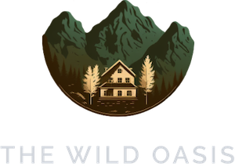
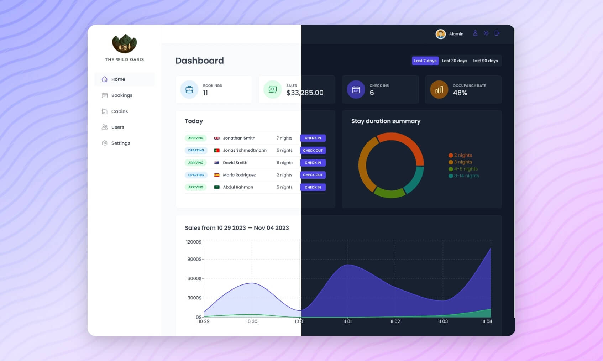

  

  <h1>The Wild Oasis - Admin</h1>

  <h3>
    <a href="https://jashan-the-wild-oasis.netlify.app">
      <strong>Live Site</strong>
    </a>
  </h3>

  

    <a href="https://jashan-the-wild-oasis.netlify.app">View website</a>
    •
    <a href="https://github.com/JashanSaini11/the-wild-oasis/issues">Report Bug</a>
    •
    <a href="https://github.com/JashanSaini11/the-wild-oasis/pulls">Request Feature</a>
  

  

<!-- Badges -->

<!-- Brief -->

Welcome to <b>The Wild Oasis</b>! This is a hotel management web app, where hotel employees can manage cabins, bookings, and guests. It uses Supabase as the backend and implements advanced React techniques such as HOCs and React Query.

<!-- Screenshot -->

## Live Site

Check out the live admin app here:  
[The Wild Oasis - Admin](https://jashan-the-wild-oasis.netlify.app)
